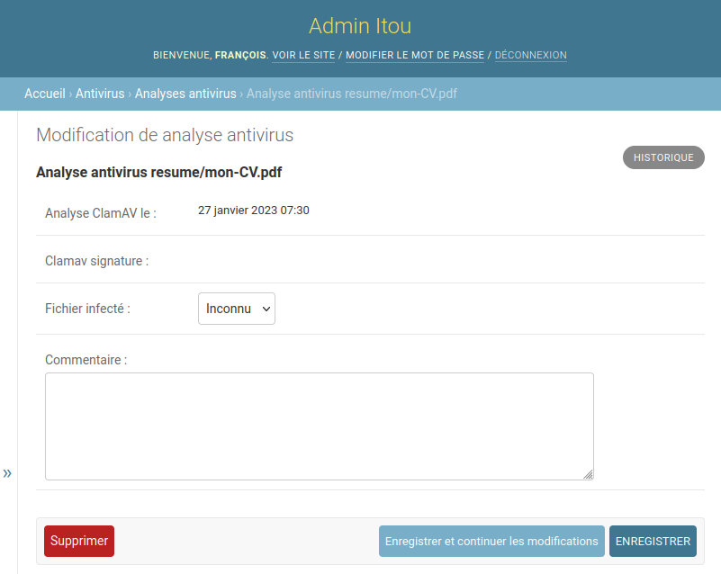

<style>
footer {
    display: flex;
    justify-content: space-around;
}
</style>

<style scoped>
p > img {
    background-color: #222;
    padding: 5px;
    margin-top: 40px;
    margin-right: 15px;
    border-radius: 10px;
}

p {
    text-align: center;
    align: center;
}
</style>

<!-- _paginate: false -->
# REX analyse antivirus
#### des fichiers de la plateforme des emplois de l’inclusion


François Freitag
[mail@franek.fr](mailto:mail@franek.fr)

  

---
<style scoped>
h1 > img {float: right;}
p > img {
margin-left: 450px;
}
</style>

# Plateforme de l’inclusion 


> Faciliter la vie des personnes en insertion et de celles et ceux qui les accompagnent à travers de nouveaux services publics.


---
# Les emplois de l’inclusion

> Les emplois de l'inclusion est un service numérique de délivrance des PASS IAE et de **mise en relation d'employeurs solidaires avec des candidats éloignés de l'emploi** par le biais de tiers (prescripteurs habilités, orienteurs) ou en autoprescription.

- Gestion des candidatures
- Orientation des candidats
- Délivrance de PASS IAE (subvention à l’embauche)

---
# Audit de sécurité

Pas de vérification antivirus des fichiers servis par la plateforme.

---
# Contraintes pour l’analyse antivirus

* 500 000+ documents
* Pas de latence perceptible à l’envoi (exigence métier)
* Envoi direct des documents sur S3 pour des raisons historiques

---
# L’antivirus


- Gratuit et open-source
- Utilisé dans d’autres start-ups d’État
- CleverCloud : `CC_CLAMAV=1`

---
# Test de performance de ClamAV

Échantillon de 10 000 fichiers aléatoires.

Temps d’analyse par fichier :
- En moyenne : 1 seconde
- Maximum : 20 secondes

Latence perceptible ⇒ pas d’analyse lors de la requête HTTP

---
# Schéma d’analyse
- Analyse quotidienne des nouveaux fichiers
- Analyse mensuelle de tous les fichiers : nouvelles signatures de virus

---
# Analyse des fichiers *a minima*

`cron` : pas de latence perceptible, mais moins de sécurité.

* Identifie les fichiers à analyser
* Les télécharge : `ThreadPoolExecutor` + `TemporaryDirectory` :heart:
* Analyse avec ClamAV : `subprocess.run()`
* Enregistre le résultat dans la base de données : *ORM* Django :heart:

---
# Mise en prod de la version *a minima*

- Analyse quotidienne des nouveaux fichiers
    * Parcours des objets S3 : environ 5 minutes
    * Analyse : environ 5 minutes
- Analyse mensuelle de tous les fichiers
    * Parcours des objets S3 : environ 5 minutes
    * Analyse : environ **17 280 minutes** *(ou 3 jours)*
    * `SIGTERM` lors des déploiements chez CleverCloud (ZDD)

---
#  Pas très satisfaisant…

Comment éviter les interruptions liées au déploiement ? 🤔

* Pas de déploiement pendant 3 jours 🤨
* Création d’un mécanisme de reprise
    * Gestion du signal `SIGTERM` ⚠🐉
    * Quid d’un échec sans `SIGTERM` ?
    * Acquittement : sous quel délai ?
    * La réponse “D” : réfléchir plus

---
# Analyse des fichiers (en mieux)
`cron`
- Identifie **mieux** les fichiers à analyser
- Les télécharge : `ThreadPoolExecutor` + `TemporaryDirectory` :heart:
- Analyse avec ClamAV : `subprocess.run()`
- Enregistre le résultat dans la base de données : *ORM* Django :heart:

---
# Analyse des fichiers (en mieux)

**Une fois par jour**

`cron` synchronisation S3 → base de données

---
# Analyse des fichiers (en mieux)

**Une fois par jour**

`cron` synchronisation S3 → base de données

**Plein de fois par jour**

Sélection d’un lot de fichiers (récents ou dernière analyse > un mois)

```python
select_for_update(skip_locked=True, no_key=True)
```

---
# Analyse des fichiers (en mieux)

Que nous apporte la base de données ?
* Nettoyage automatique du verrou en cas d’échec
* Gestion de la concurrence
* Cerise sur le gâteau ?
    * Elle est déjà en place.

---
<style scoped>
p > img {
    margin-left: 300px;
}
</style>
# Une analyse dans l’admin Django



---
# Le résultat 🥁

624 375 fichiers scannés pour trouver…

---
<style scoped>
h2 {text-align: center}
</style>
# Le résultat 🥁

624 375 fichiers scannés pour trouver…

## 0 virus 🕺

---
# Comment aller plus loin ?

- Stocker les fichiers via Django
- Zone de quarantaine S3
- Parallélisation des analyses
- Gestion des fichiers infectés : *API* VirusTotal

---
# Je peux voir le code ?

C’est open-source, ça fait 129 lignes.

<!-- QR Code -->
https://github.com/betagouv/itou/blob/master/itou/antivirus/management/commands/scan_s3_files.py

---
<style scoped>
h1 {
    font-size: 280px;
    text-align: center;
}
h2 {
    text-align: center;
}
</style>
# Merci
## Avez-vous des questions ?
